# delivery-skills

Claude Code skills for one way of shipping code with AI agents: **plan
together, build in chunks a human can read, review every chunk against a
domain rubric, never commit on the agent's behalf.**

Two halves:

- **Delivery** — how subagents are dispatched, which model fills which role,
  and where the run stops for a human.
- **Review rubrics** — single-file reviews for React, Angular, NestJS, Prisma
  and shared API contracts, each with a checklist, invariants, and two shell
  scripts that print live facts about the repository before judgement starts.

## Install

```
/plugin marketplace add vilkoalexander/delivery-skills
/plugin install delivery-skills@vilkoalexander
```

Skills then appear as `delivery-skills:<name>`. Update later with
`/plugin marketplace update vilkoalexander`.

## How it works

### One chunk at a time

A plan is grouped into chunks a human can read in one sitting. Each chunk is
snapshotted, implemented, reviewed to clean, reported in a few lines,
and then the run **stops** until the human answers. Nothing is committed at
any point; the working tree is the deliverable.



### Who does what, on which model

The controller holds the plan. Every task carries a risk class — low, medium
or high — set by what it touches, not how hard it looks. The class picks the
implementer and reviewer models, whether the chunk is reviewed at all (low-risk
chunks go straight to the human), and how many fix rounds it gets. A second
model family reads the diff on high-risk chunks and once over the whole tree;
its findings are claims the controller rules on, not a fix queue.



### Routing a diff to rubrics

Each rubric reviews one file. A diff is routed by path shape to the rubrics it
touches, each rubric runs once over everything it owns, and the findings merge
into one ranked list.



The mermaid sources live in `diagrams/*.mmd`; the `.excalidraw` files next to
them open at excalidraw.com for editing.

## Skills

### Delivery

| Skill | What it settles |
| --- | --- |
| `delivery-pipeline` | Model per role (controller, implementer, reviewer, re-review), the three risk classes and what each buys (`scripts/risk.sh` suggests one from changed paths), the Global Constraints block every plan carries, how review works when nothing is committed, what the controller does and does not read, and where a second model family reads the diff. Builds on `superpowers:subagent-driven-development`. |
| `chunked-delivery` | Runs an approved plan one chunk at a time. Each chunk: snapshot, implement, review to clean on medium and high risk (three fix rounds, five on high; low-risk chunks skip review), report briefly, **stop**. Nothing proceeds until the human says `next`. Ends with a whole-tree review. |
| `review-routing` | Maps changed paths in a diff to the rubrics below and says how to apply a single-file rubric to a multi-file diff — one pass per rubric, only the two rubric files loaded, judge only what the change contributed, merge into one ranked list. Scoped re-reviews skip it entirely. |

### Review rubrics

| Skill | Reviews | Always 🔴 |
| --- | --- | --- |
| `react-review` | One `.tsx` component, React or React Native | conditional hooks · effect without cleanup · `.map()` in a `ScrollView` on unbounded data |
| `angular-review` | One component + template + stylesheet, directive or pipe | subscribe without teardown · `effect()` writing state · clickable `<div>` |
| `nestjs-service-review` | One service, controller, guard, interceptor, pipe or module | query without tenant key · 403 on a cross-tenant miss · outer client inside `$transaction` · unawaited Prisma call |
| `prisma-schema-review` | One model file or one `migration.sql` | tenant key missing or not leading an index · money as `Float` · stored balance beside a ledger · mutable ledger · edited applied migration |
| `api-contract-review` | One change to a shared schema / DTO / type package | response field removed or narrowed · new required request field · backend import in a client bundle · enum that no longer covers the database |

Every rubric shares one shape:

```
<name>/
  SKILL.md        single-file entry point: workflow · effort · output format
  CHECKLIST.md    the rubric: version baseline · tooling coverage · severity floor ·
                  the rules, each tagged [hard] / [prefer] / [context] · do-not-report
  INVARIANTS.md   the one-way doors, and what the project layer must supply   (UI rubrics: INVENTORY.md)
  SOURCES.md      references behind the checklist; never loaded during a review
  scripts/
    scan.sh       mechanical pre-scan of one file — flags, never a verdict
    inventory.sh  what exists right now — shared primitives, modules, models — so nothing is reinvented
```

A diff review loads `CHECKLIST.md` and `INVARIANTS.md` / `INVENTORY.md` only;
`SKILL.md` is for reviewing one named file.

And one output shape:

```
### <file> review

🔴 <file:line> — <one-sentence defect>
   why: <what breaks, concretely>
   ```diff
   - before
   + after
   ```
🟡 …
⚪ …

Verdict: SHIP | FIX FIRST — <one line>
```

Effort defaults to medium — 🔴 and 🟡 only, and **zero findings is a valid
outcome**. A short report of real defects beats an exhaustive one.

## The project layer

A rubric knows the framework. It does not know *your* codebase — which file is
the reference service, which primitives exist, which columns are forward hooks,
which features are deliberately deferred. That lives in your repository at
`docs/review/<rubric-name>.md`, and each rubric loads it at step 2.

`templates/` has one starting point per rubric and a README on the two ways to
attach project knowledge: the project layer file, or forking the whole skill
into `.claude/skills/` where it shadows the plugin's.

The scripts take the project-specific names from the environment:

| Variable | Used by | Meaning |
| --- | --- | --- |
| `TENANT_FIELD` | nestjs, prisma | tenant key column; `""` for single-tenant |
| `EXEMPT_MODELS` | nestjs, prisma | models deliberately without the tenant key, `\|`-separated |
| `LEDGER_TABLES` | prisma | append-only tables by `@@map` name, `\|`-separated |
| `CLIENT_LIBS` | api-contract | package dirs that reach a client bundle |
| `INVENTORY_LIMIT` | all `inventory.sh` | lines per section before the output is cut with an overflow count (default 40) |
| `INVENTORY_DOCS` | react, angular | `1` adds each module's first doc-comment line |
| `REVIEW_FILES` | nestjs | space-separated files under review; limits the missing-spec check to them |

## Token budget

`bash scripts/token-budget.sh` prints an estimate of what each dispatch loads
— controller start, one task reviewer per rubric, the extra per added rubric
— so a change to a skill can be checked against what it costs every task.

## Design notes

- **Rules carry confidence tags.** `[hard]` is always reported; `[prefer]`
  unless the file gives a reason; `[context]` only with a concrete consequence
  in this file. Flattening everything into absolutes is how reviews become
  noise.
- **Scripts print facts, not verdicts.** `scan.sh` targets what lint in a
  typical project does *not* catch — a non-type-aware ESLint setup, no hooks
  plugin, no schema linter. `inventory.sh` exists because reinvention is the
  most common miss in AI-generated code and a stale mental inventory is why.
- **Do-not-report is as important as the checklist.** Each rubric names the
  suggestions it must not make — deferred features, decisions already taken,
  the other rubric's territory.
- **Version baselines are read, not assumed.** Each rubric says which
  installed versions flip which rules (React 19, the React Compiler, Angular
  17 / 19 / 20, Prisma 5, Postgres 11).
- **Every dispatch loads only what it acts on.** The controller never reads a
  diff; a task reviewer reads two rubric files, not the rubric's skill; a
  scoped re-review reads the findings and the fix diff and nothing else;
  inventory scripts cut their output at a limit.
- **Nothing is committed by an agent.** The delivery skills override the
  upstream "commit your work" step. The human reads the working tree and
  decides what becomes a commit.

## License

MIT
