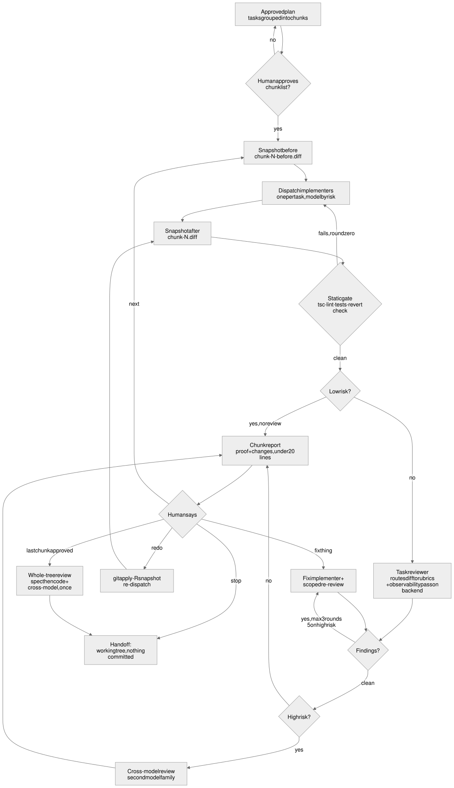
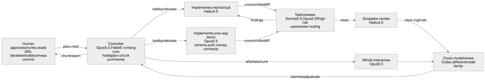
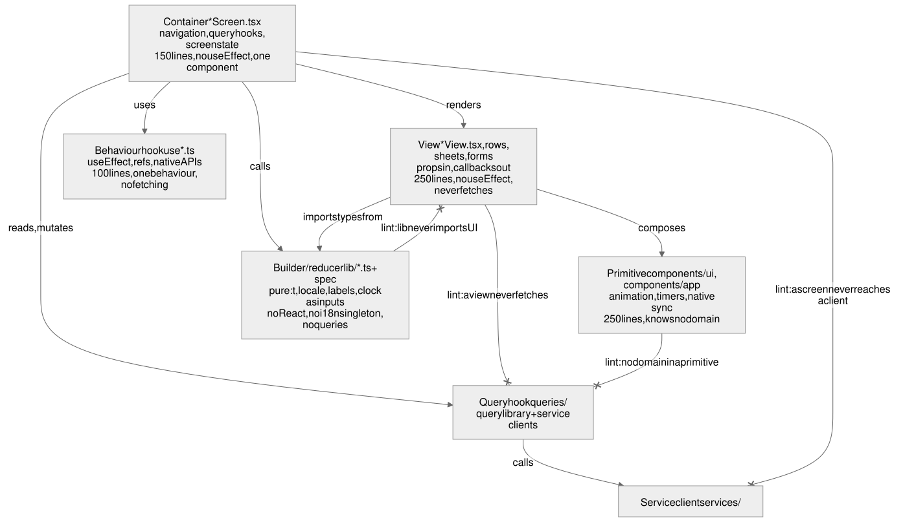
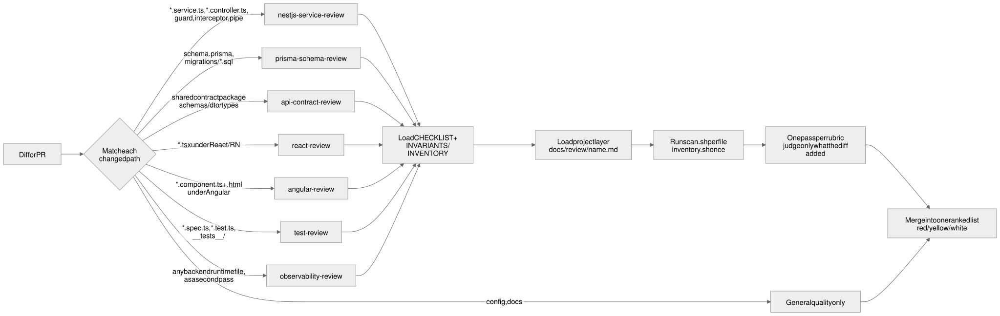

# delivery-skills

Claude Code skills for shipping code with subagents without losing control of
it. The agents plan with you, build in small chunks, and stop after each one
so you can read the diff. Nothing is ever committed on your behalf.

## Install

```
/plugin marketplace add vilkoalexander/delivery-skills
/plugin install delivery-skills@vilkoalexander
```

Skills appear as `delivery-skills:<name>`.

## What a run looks like

1. You approve a plan split into chunks. Each chunk is something you can read
   in one sitting and carries a risk class: low, medium or high.
2. For each chunk, subagents implement it. An implementer creating a new
   screen reads the authoring checklist for it first. The toolchain runs
   next: typecheck, lint, related tests, and a check that new tests fail when
   the change is reverted. Anything that fails goes straight back to the
   implementer.
3. A reviewer reads the diff against the rubrics for the files it touches.
   Low-risk chunks skip this; you read those yourself.
4. You get a short report: which files are high, medium or low risk, what
   changed, what the implementer ran and saw, what was fixed, what was left.
5. The run stops. You say `next`, `fix <thing>`, `redo` or `stop`.
6. After the last chunk, one review reads the whole tree against the plan's
   acceptance criteria, then a second model family reads it too.



Risk class decides everything else: which model implements and reviews, how
many fix rounds a chunk gets, and whether a second model family looks at it.
It comes from what a change touches, not how hard it looks. Schema, auth,
money and shared contracts are high. Feature-local UI is low.



## The skills

Three run the delivery:

| Skill | Does |
| --- | --- |
| `delivery-pipeline` | The settings: model per role, risk classes, the static gate, what every implementer report must prove, and how review works with nothing committed. |
| `chunked-delivery` | The loop above. Runs one chunk, reports, stops. |
| `review-routing` | Maps changed files to the rubrics below and merges their findings into one ranked list. |

Seven review one kind of file:

| Skill | Reviews |
| --- | --- |
| `react-review` | A React or React Native component |
| `angular-review` | An Angular component, directive or pipe |
| `nestjs-service-review` | A NestJS service, controller, guard, interceptor, pipe or module |
| `prisma-schema-review` | A Prisma model file or migration |
| `api-contract-review` | A change to a shared schema, DTO or type package |
| `test-review` | A test file, judged on whether it can fail |
| `observability-review` | A backend file, judged on whether it can be debugged in production |

Each rubric is a checklist with rules tagged by confidence, a list of things
it must not report, and two scripts: one that scans a file for mechanical
smells, one that lists what already exists in the repo so nothing gets
reinvented. Reports are short. Zero findings is a valid outcome.

One runs before generation instead of after:

| Skill | Does |
| --- | --- |
| `react-screen-authoring` | Read before a new screen, sheet, form or picker is written. The container / view / builder split, the contracts a builder and a view keep, the platform checklist, and the lint that enforces the split. Shares `react-review`'s inventory script; `react-review` judges the result against the same table. |

One cleans up what is already there:

| Skill | Does |
| --- | --- |
| `comment-cleanup` | Deletes or shrinks the comments a reader does not need, across a file, a directory or the repo, and proves the diff touched comment lines only. Its `RULES.md` is the comment rule every implementer and reviewer here works to: none by default, one line, and only for a why the code cannot show. |





## Making it yours

The rubrics know the framework. They do not know your codebase. Tell them
with one file per rubric at `docs/review/<rubric>.md`: the reference
implementations, the shared primitives, the decisions already taken. Starting
points and the script variables are in [`templates/`](templates/README.md).

`bash scripts/static-gate.sh coverage` prints which analyzers your project
enforces and which it lacks. For each gap, `STATIC-SETUP.md` in the
delivery-pipeline skill has the strict setup. Anything lint enforces never
reaches a reviewer.

`bash scripts/token-budget.sh` shows what each dispatch loads, so you can
see what an edit to a skill costs every task.

Set `TYPESAFE_API_KEY` and `scripts/risk.sh` stops guessing at the escalators
it cannot see from paths. Each changed file's diff goes to
[TypeSafe's Jev model](https://docs.typesafe.ai) as six yes/no questions —
signature changed, caller sees a change, production data path, deletes data,
auth or money, additive only — and the class is raised in code from the
probabilities, never lowered. Borderline files are listed as `unsure:` for
you to settle at plan approval. Without the key the controller reads the
diff for the escalators itself, as before.

## Why it is built this way

- The human reads the working tree, not a commit log. Agents never run
  `git commit`.
- Machines check first. A diff that fails tsc or lint never costs a review.
- Proof over prose. An implementer report ends with what ran, what it shows,
  and what was not verified.
- Every dispatch loads only what it acts on. The controller never reads a
  diff.

## License

MIT
